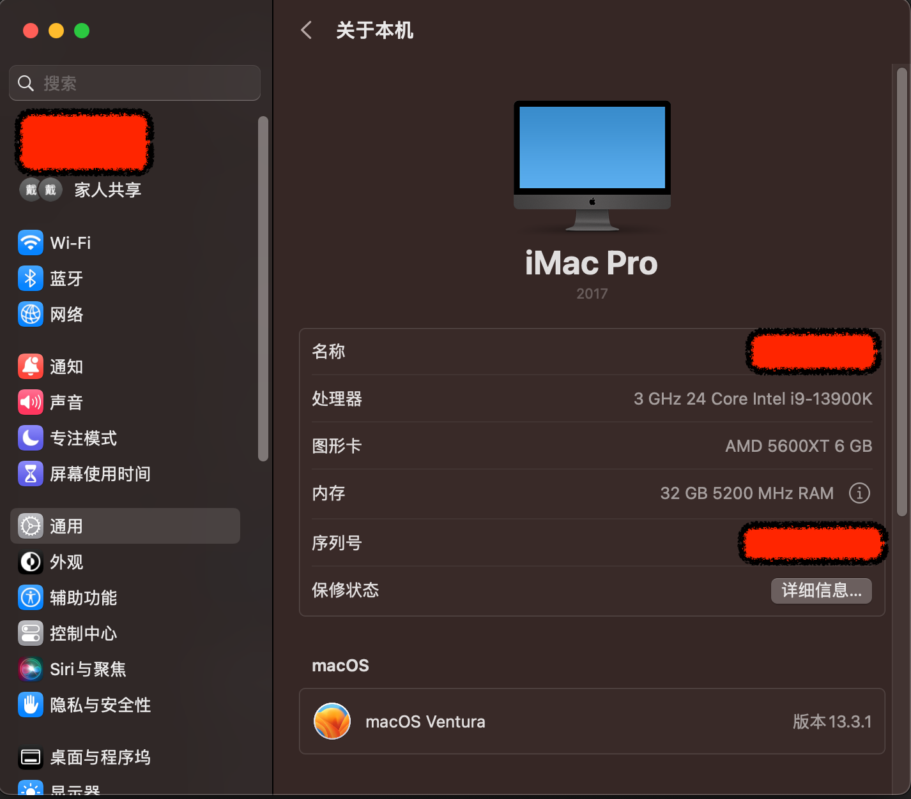

## 硬件配置

CPU：13900K

主板：华硕 TUF-Z690P 

内存：金斯顿 5200MHz 16Gx2

硬盘：金斯顿 1T PCI4

## 目标系统版本

12/13.3.1

## 其他

### 声卡

华硕的 Z690 的声卡 layout id 是 Realtek ALC897  0x100402, 0x100500, layout 11, 12, 13, 21, 23, 66, 69, 77

我是用 layout 11驱动的，若是驱动不了，可以尝试其他的数字。

可以在 windows 下面用这个软件查看声卡型号。

[Free Download HWiNFO Sofware | Installer & Portable for Windows, DOS](https://www.hwinfo.com/download/)

### 操作系统

我是先安装的 12 ，然后通过升级直接升级到 13.3.1 的，`升级前注意备份硬盘和 EFI`。

12的时候蓝牙和 wifi 都 OK，升级到13后，板载wifi 不能用了，wifi 我没需求，所以不折腾了。

### 截图

